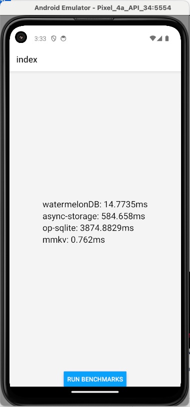
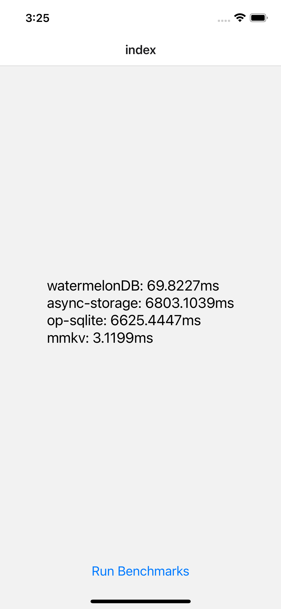
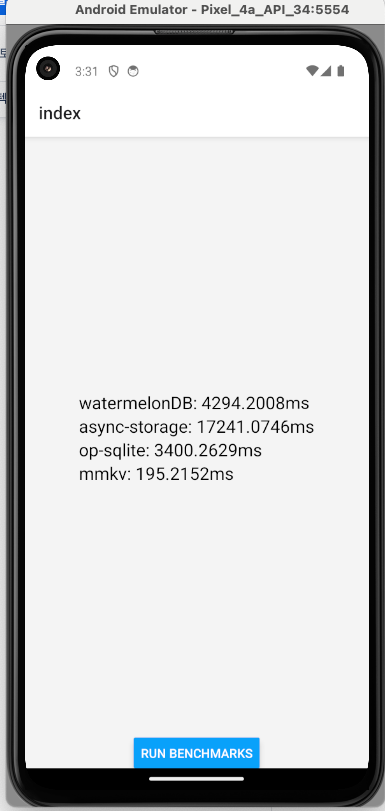
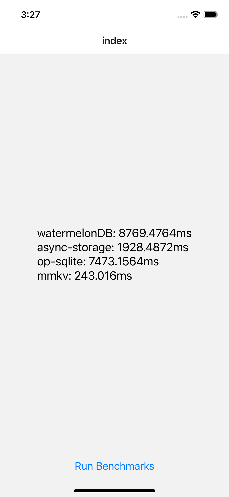

# React Native에서 많이 사용되는 Storage 라이브러리간 비교

1. AsyncStorage
2. OP-SQLite
3. WatermelonDB
4. MMKV

# 비교 시나리오와 결과

각 스토리지 라이브러리에서 조회를 1000번 반복한 후에 시간을 측정

## 1번 시나리오
- 초기화 후, key: 'k', value: 'hello' 저장
- value 가져오기
<table>
    <tr>
        <th>안드로이드</th>
        <th>iOS</th>
    </tr>
    <tr>
        <td></td>
        <td></td>
    </tr>
</table>

성능: mmkv> watermelonDB> op-sqlite> asyncStorage

## 2번 시나리오
- 초기화 후 key:'k', value: 길이가 100000개인 배열 저장
- value 가져오기

<table>
    <tr>
        <th>안드로이드</th>
        <th>iOS</th>
    </tr>
    <tr>
        <td></td>
        <td></td>
    </tr>
</table>

성능:mmkv> watermelonDB> op-sqlite> asyncStorage

## 정리
모든 케이스에서 mmkv가 가장 좋다
